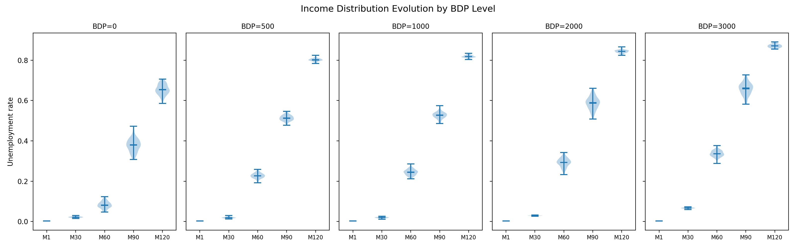
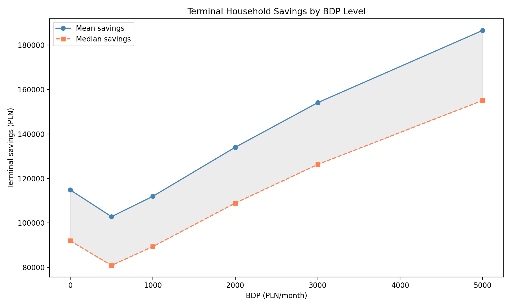
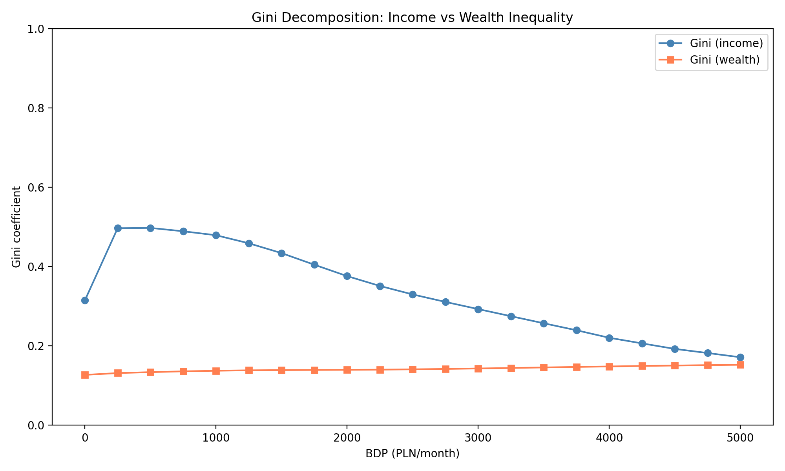
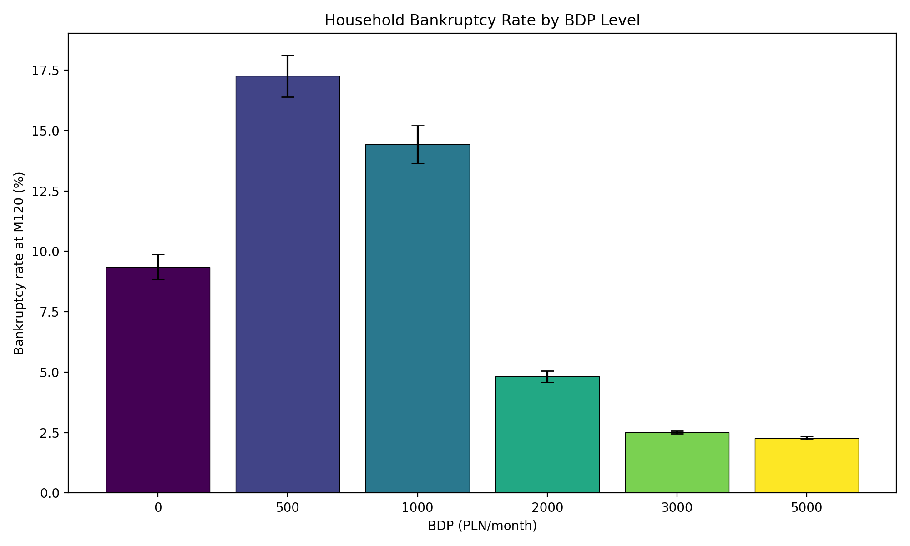
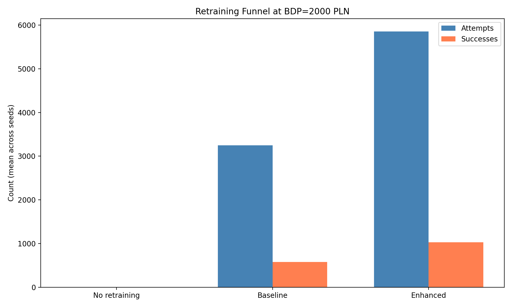
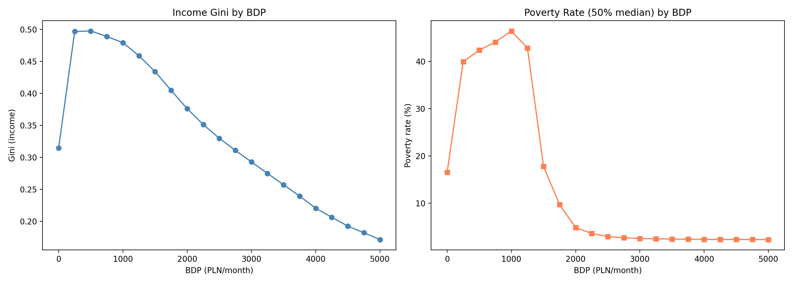
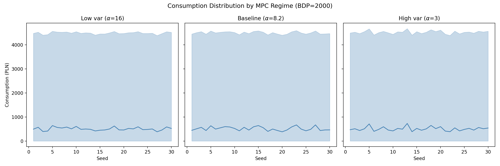
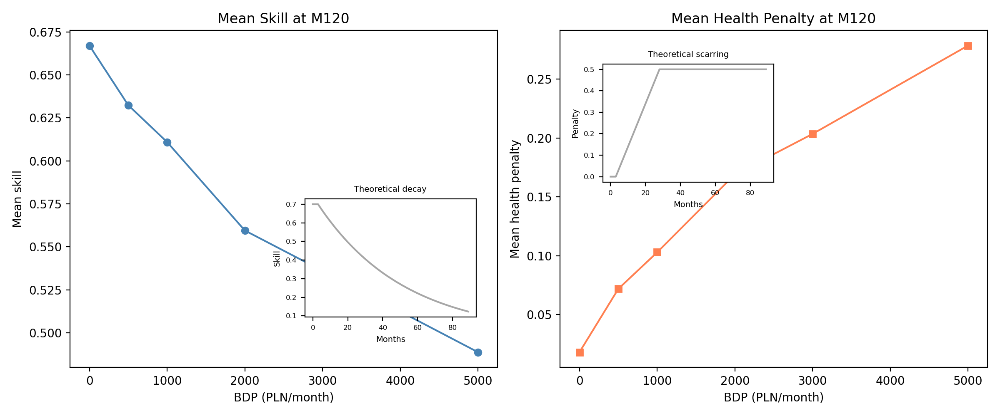

# Heterogeneous Households and the Limits of Universal Basic Income

[**Read the paper (PDF)**](paper/paper.pdf)

Sixth paper in the [complexity-econ](https://github.com/complexity-econ) series. Replaces the aggregate household sector from Papers I--V with 100,000 individual agents, each with heterogeneous savings, debt, rent, MPC, skills, and health capital. Reveals that the critical point BDP_c = 500 PLN---previously identified as a policy "sweet spot"---is in fact the zone of maximum microstructural destruction.

## Key Findings

- **Aggregate metrics mask destruction**: BDP_c = 500 shows low aggregate Gini (~0.20) but individual-level analysis reveals peak bankruptcy (17.3%), peak poverty (45%), and peak income Gini (~0.50)
- **Scarring creates hysteresis**: Skill decay (-2%/month) and health penalties (+2%/month) accumulate during unemployment, producing path-dependent human capital destruction invisible to aggregate models
- **Retraining catch-22**: Even enhanced retraining (2x probability, half cost, half duration) achieves only ~18% success rate---because success depends on skill × (1 - health penalty), both degraded by the unemployment spell preceding eligibility
- **UBI solves income, not human capital**: High BDP (≥3,000 PLN) reduces income Gini to 0.15 and poverty below 10%, but produces the highest scarring levels
- **MPC heterogeneity is second-order**: Three MPC distributions (low/baseline/high variance) produce similar macro outcomes---automation dynamics dominate consumption heterogeneity

## Simulation Campaigns

| Campaign | Simulations | Description |
|----------|------------|-------------|
| C1 Validation | 60 | Aggregate vs individual, 5 BDP levels × 2 modes × 30 seeds |
| C2 BDP Sweep | 630 | 21 BDP levels (0--5,000 by 250) × 30 seeds |
| C3 MPC Sensitivity | 270 | 3 MPC distributions × 3 BDP × 30 seeds |
| C4 Wealth Sensitivity | 270 | 3 initial wealth configs × 3 BDP × 30 seeds |
| C5 Retraining Policy | 270 | 3 retraining configs × 3 BDP × 30 seeds |
| **Total** | **1,500** | |

## Figures

### Distribution Evolution (C2)


**Fig 1.** Unemployment rate distribution over time by BDP level. Violin widths show cross-seed variation. Higher BDP produces both higher mean unemployment and greater dispersion.

### Savings Trajectories (C2)


**Fig 2.** Terminal savings (mean and median) by BDP. Mean > median at all levels (right-skewed). Dip at BDP=500 reflects selective attrition of low-savings households.

### Gini Decomposition (C2)


**Fig 3.** Income Gini peaks ~0.50 at BDP_c, then falls as UBI provides income floor. Wealth Gini flat at ~0.14---UBI redistributes income but not wealth.

### Bankruptcy Cascade (C2)


**Fig 4.** Bankruptcy rate peaks at BDP=500 (17.3%)---the critical point is the zone of maximum household destruction, not a sweet spot.

### Retraining Funnel (C5)


**Fig 5.** Enhanced retraining generates ~2x more attempts but success rate stays ~18%. The catch-22: scarring degrades the human capital base that retraining operates on.

### Welfare Comparison (C2)


**Fig 6.** Income Gini and poverty rate by BDP. Non-monotonic poverty: peaks ~45% at BDP=500--1,000. Moderate UBI is worse than no UBI on poverty metrics.

### MPC Sensitivity (C3)


**Fig 7.** Consumption distribution across three MPC regimes. Similar P10--P90 bands confirm that macro dynamics dominate micro consumption heterogeneity.

### Scarring Dynamics (C2)


**Fig 8.** Skill decay and health penalty increase monotonically with BDP. More automation → longer unemployment → deeper human capital destruction. Insets show theoretical single-agent scarring curves.

## Repository Structure

```
analysis/              — 8 Python scripts generating figures
figures/               — Generated PNG figures (200 DPI)
paper/                 — Paper source (XeLaTeX + biblatex)
simulations/
  scripts/             — 5 campaign runner scripts + run_all.sh
  results/             — Terminal CSV files (European format: ; separator, , decimal)
```

## Dependencies

- **Engine**: [complexity-econ/core](https://github.com/complexity-econ/core) (Scala 3.5.2, sbt)
- **Analysis**: Python 3 (matplotlib, numpy, pandas)
- **Paper**: XeLaTeX + biblatex

## Running

```bash
# Build the engine JAR first
cd ../core && sbt assembly

# Run all simulation campaigns (~24h with 10K firms + 100K HH)
cd simulations/scripts && bash run_all.sh

# Generate all figures
for f in analysis/fig*.py; do python3 "$f"; done

# Compile paper
cd paper && xelatex paper.tex && bibtex paper && xelatex paper.tex && xelatex paper.tex
```

## Series

| # | Paper | DOI |
|---|-------|-----|
| 01 | [The Acceleration Paradox](https://github.com/complexity-econ/paper-01-acceleration-paradox) | [10.5281/zenodo.18727928](https://doi.org/10.5281/zenodo.18727928) |
| 02 | [Monetary Regime & Automation](https://github.com/complexity-econ/paper-02-monetary-regimes) | [10.5281/zenodo.18740933](https://doi.org/10.5281/zenodo.18740933) |
| 03 | [Empirical σ Estimation](https://github.com/complexity-econ/paper-03-empirical-sigma) | [10.5281/zenodo.18743780](https://doi.org/10.5281/zenodo.18743780) |
| 04 | [Phase Diagram & Universality](https://github.com/complexity-econ/paper-04-phase-diagram) | [10.5281/zenodo.18751083](https://doi.org/10.5281/zenodo.18751083) |
| 05 | [Endogenous Technology & Networks](https://github.com/complexity-econ/paper-05-endogenous) | [10.5281/zenodo.18758365](https://doi.org/10.5281/zenodo.18758365) |
| **06** | **Heterogeneous Households** | *pending* |

## License

MIT
